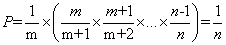
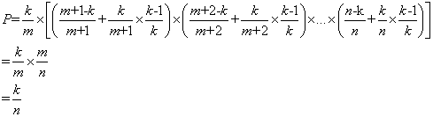

## 水塘抽样 1(第 m 个对象最终被选中的概率 P=选择 m 的概率\*其后面所有对象不被选择的概率)



## 水塘抽样 restBucket(第 m 个对象被选中的概率=选择 m 的概率*（其后元素不被选择的概率+其后元素被选择的概率*不替换第 m 个对象的概率)



## 加权随机抽样(计算权重的得分)

```
function getSampleScore(weight: number): number {
  return Math.pow(Math.random(), 1 / weight);
}
```
